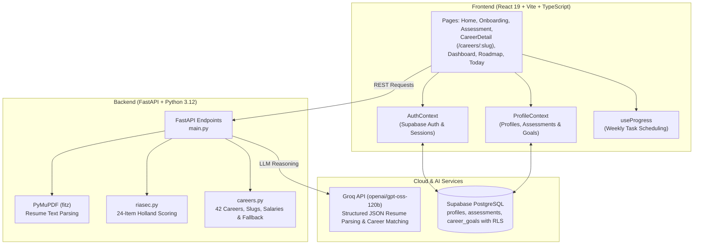

# AI Personal Career Counselor

An AI-powered career counseling and guidance platform built for college students. It combines psychometric profiling, resume extraction, subconscious identity discovery, and contextual AI reasoning to help students choose the right career path and follow a structured, weekly roadmap toward job readiness.

- **Frontend:** React 19 + Vite + TypeScript + Tailwind CSS v4 + Framer Motion
- **Backend:** FastAPI (Python 3.12), PyMuPDF (PDF extraction), Groq (GPT-OSS 120B, JSON mode)
- **Database & Auth:** Supabase (PostgreSQL, Row Level Security, Supabase Auth)

> 📘 **Planning to build or contribute?** Read the full architectural specification and roadmap in [`docs/BLUEPRINT.md`](docs/BLUEPRINT.md).

---

## Table of Contents

- [Vision & Architecture](#vision--architecture)
- [Feature Status](#feature-status)
- [Tech Stack](#tech-stack)
- [Project Structure](#project-structure)
- [Prerequisites](#prerequisites)
- [Setup & Installation](#setup--installation)
  - [1. Database Setup (Supabase)](#1-database-setup-supabase)
  - [2. Backend Setup (FastAPI)](#2-backend-setup-fastapi)
  - [3. Frontend Setup (React + Vite)](#3-frontend-setup-react--vite)
- [Environment Variables](#environment-variables)
- [Running the Application](#running-the-application)
- [REST API Reference](#rest-api-reference)
- [Database Schema & Security (RLS)](#database-schema--security-rls)
- [Project Roadmap](#project-roadmap)
- [Notes for Contributors](#notes-for-contributors)

---

## Vision & Architecture

Most career guidance products either offer a generic one-time quiz or a static 50-item checklist. Students need a platform that acts first as a **Counselor** (*"Which career actually fits who I am?"*) and then transitions into a **Daily Coach** (*"What do I do today to get closer to being hired?"*).



---

## Feature Status

| Area / Module | Status | Description |
|---|:---:|---|
| **Marketing Landing** | ✅ | Modern landing page with value proposition, counselor highlights, and call to action (`/`). |
| **Authentication & Sessions** | ✅ | Email/password + Google OAuth sign-in via Supabase Auth, password reset, and protected routes. |
| **Student Onboarding** | ✅ | Survey capturing education, degree, study year, interests, weekly hours, and drag-and-drop resume upload. |
| **Resume Parsing** | ✅ | Extracts name, education, skills, and experience via PyMuPDF + Groq LLM (with fallback). |
| **Psychometric Assessment** | ✅ | 24-question Holland/RIASEC assessment with deterministic mathematical scoring (0–100%). |
| **Subconscious Identity Profiling** | ✅ | Uncovers inner drive via the Equal-Salary test, energy source audit, secret envy compass, and anti-goal deal-breakers. |
| **AI Career Matching** | ✅ | Groq GPT-OSS 120B ranks top 5 allowed careers with personalized reasons and watch-outs; deterministic rule-based fallback if offline. |
| **Career Detail Exploration** | ✅ | Dedicated `/careers/:slug` pages with Indian salary tiers (Fresher/Mid/Senior), daily hourly schedules, pros/cons, and learning paths. |
| **Career Goal Confirmation** | ✅ | Explicit goal commitment dialog that writes active goals to Supabase `career_goals` with RLS. |
| **Roadmap & Timetable** | ✅ | Weekly task packing, interactive checkboxes, and pace adaptation according to year of study (`/roadmap`, `/today`). |
| **O\*NET Vector Embeddings** | 🚧 *(Stage 3)* | Scaling from 42 static careers to 900+ careers using `sentence-transformers` and Supabase `pgvector`. |
| **NLP Skill-Gap Analysis** | 🚧 *(Stage 3)* | Pinpointing precise missing skills between uploaded resume and target job requirements using NLP. |
| **Gamified Nature Level Map** | 🚧 *(Stage 4)* | Visual stage map where levels unlock via checkpoints (quizzes/projects). |
| **AI Career Coach Chatbot** | 🚧 *(Stage 4)* | Context-aware daily coaching chatbot with memory. |

---

## Tech Stack

### Backend
- **FastAPI** + **Uvicorn** — Modern, high-performance async REST API framework.
- **PyMuPDF (`fitz`)** — High-speed local PDF text extraction.
- **groq** — Ultra-fast inference on `openai/gpt-oss-120b` utilizing Groq LPUs.
- **Pydantic v2** — Request/response data validation and serialization.
- **python-multipart** — File upload handling for PDF resumes.
- **python-dotenv** — Environment configuration loader.

### Frontend
- **React 19** + **Vite 8** — Reactive UI framework with fast Hot Module Replacement (HMR).
- **TypeScript 6** — Strict static typing across components, contexts, and API schemas.
- **Tailwind CSS v4** — Utility-first modern responsive styling.
- **React Router v7** — Client-side SPA routing (`react-router-dom`).
- **@supabase/supabase-js** — Supabase client for authentication, session recovery, and PostgreSQL queries.
- **Framer Motion** — Smooth layout transitions and interactive animations.
- **Lucide React** — Consistent icon set.
- **Oxlint** — High-speed JavaScript/TypeScript linter.

---

## Project Structure

```
AI-Personal-Career-Counselor/
├── backend/
│   ├── main.py              # FastAPI application & REST endpoints
│   ├── careers.py           # 42-career taxonomy, slugs, Indian salary tiers, daily routines & fallback
│   ├── riasec.py            # 24 RIASEC items, dimensions & deterministic scoring logic
│   ├── requirements.txt     # Python dependencies
│   ├── .env.example         # Example backend environment variables
│   └── venv/                # Local Python virtual environment
├── frontend/
│   ├── src/
│   │   ├── App.tsx          # Client-side router and root providers
│   │   ├── main.tsx         # React DOM entry point
│   │   ├── index.css        # Tailwind CSS imports & global design tokens
│   │   ├── context/
│   │   │   ├── AuthContext.tsx    # Supabase authentication session management
│   │   │   └── ProfileContext.tsx # Database profile & assessment loader/persister
│   │   ├── components/
│   │   │   ├── AppHeader.tsx      # Navigation header with profile status
│   │   │   ├── KnowMeSection.tsx  # Interactive UI for values, strengths, identity, and situation
│   │   │   ├── ProtectedRoute.tsx # Route guard redirecting unauthenticated users
│   │   │   └── ThisWeekPanel.tsx  # Weekly task checklist and timetable component
│   │   ├── pages/
│   │   │   ├── Home.tsx           # Marketing landing page
│   │   │   ├── Login.tsx          # User sign-in & password recovery
│   │   │   ├── Signup.tsx         # User registration with Supabase Auth
│   │   │   ├── Onboarding.tsx     # Student survey & PDF resume upload
│   │   │   ├── Assessment.tsx     # 6-step discovery: Interests, Workstyle, Values, Strengths, Identity, Situation
│   │   │   ├── CareerDetail.tsx   # Detailed career page (/careers/:slug) with Indian salaries & goal commitment
│   │   │   ├── Dashboard.tsx      # Student status, Holland code, matched careers & quick links
│   │   │   ├── Roadmap.tsx        # Milestone progression, skill toggles & weekly hours
│   │   │   └── Today.tsx          # Weekly focused tasks & daily actions
│   │   ├── lib/
│   │   │   ├── api.ts             # Backend base URL configuration
│   │   │   ├── assessment.ts      # API call helpers and RIASEC types
│   │   │   ├── knowMe.ts          # Schemas, option sets, and API formatters for KnowMe & Identity
│   │   │   ├── onboarding.ts      # Onboarding types & pace calculations
│   │   │   ├── planner.ts         # Greedy weekly task scheduler & timetable generator
│   │   │   ├── profile.ts         # Supabase database queries for profiles, assessments, and career_goals
│   │   │   ├── supabase.ts        # Supabase client instantiation
│   │   │   └── useProgress.ts     # Task completion and timetable progress hook
│   │   └── data/
│   │       └── roadmaps.ts        # Curated skill roadmaps
│   ├── package.json
│   ├── tsconfig.json
│   └── vite.config.ts
├── supabase/
│   └── migrations/
│       └── 0001_phase1_counselor.sql # Idempotent PostgreSQL schema with Row Level Security (RLS)
├── docs/
│   └── BLUEPRINT.md         # Comprehensive product plan, data models, and module specifications
└── README.md
```

---

## Prerequisites

| Tool | Recommended Version | Notes |
|---|:---:|---|
| **Python** | 3.11+ / 3.12 | Required for FastAPI backend and PyMuPDF |
| **Node.js** | 20+ | Required for Vite 8 and React 19 |
| **npm** | 10+ | Bundled with Node.js |
| **Supabase Account** | Cloud (Free tier) | For PostgreSQL database and Supabase Auth |
| **Groq API Key** | Optional (Free tier) | Powers LLM resume extraction and matching; app falls back to rule-based logic without it |

---

## Setup & Installation

### 1. Database Setup (Supabase)

1. Create a free project at [supabase.com](https://supabase.com/).
2. In the Supabase Dashboard, open the **SQL Editor** (`>_` icon on the left menu).
3. Click **New query**, paste the entire contents of [`supabase/migrations/0001_phase1_counselor.sql`](supabase/migrations/0001_phase1_counselor.sql), and click **Run**.
4. Verify under **Table Editor** that `profiles`, `assessments`, and `career_goals` are present.

### 2. Backend Setup (FastAPI)

```bash
cd backend

# Create virtual environment
python -m venv venv

# Activate virtual environment
# Windows (PowerShell):
.\venv\Scripts\Activate.ps1
# Windows (cmd):
venv\Scripts\activate.bat
# macOS / Linux:
source venv/bin/activate

# Install dependencies
python -m pip install -r requirements.txt
```

Create `backend/.env` (see [Environment Variables](#environment-variables)):
```env
GROQ_API_KEY=your_groq_api_key_here
```

### 3. Frontend Setup (React + Vite)

```bash
cd frontend

# Install Node dependencies
npm install
```

Create `frontend/.env` (see [Environment Variables](#environment-variables)):
```env
VITE_SUPABASE_URL=https://your-project-id.supabase.co
VITE_SUPABASE_ANON_KEY=your-anon-public-key
VITE_API_BASE=http://localhost:8000
```

---

## Environment Variables

### Backend (`backend/.env`)
```env
# Optional — enables LLM resume parsing and contextual career matching.
# Without it, the backend operates in deterministic rule-based fallback mode.
GROQ_API_KEY=gsk_your_groq_api_key
GROQ_MODEL=openai/gpt-oss-120b
```

### Frontend (`frontend/.env`)
```env
# Required for user authentication, profile loading, and goal persistence:
VITE_SUPABASE_URL=https://your-project-id.supabase.co
VITE_SUPABASE_ANON_KEY=your-anon-public-key

# Optional — overrides the backend address if hosted elsewhere:
VITE_API_BASE=http://localhost:8000
```

---

## Running the Application

Open two terminal windows:

### Terminal 1 — Backend
```bash
cd backend
# With venv activated:
uvicorn main:app --reload --port 8000
```
- API Base: `http://localhost:8000/`
- Interactive Swagger Documentation: `http://localhost:8000/docs`

### Terminal 2 — Frontend
```bash
cd frontend
npm run dev
```
- Web Application: `http://localhost:5173/`

---

## REST API Reference

### Health Check
- **`GET /`**  
  Returns API operational status and whether AI is enabled.
  ```json
  { "message": "Welcome to AI Personal Career Counselor API", "ai_enabled": true }
  ```

### Resume Extraction
- **`POST /api/upload-resume`**  
  Accepts a `multipart/form-data` PDF file. Extracts structured personal information using PyMuPDF and Groq LLM.
  ```json
  {
    "name": "Alex Johnson",
    "education": ["B.Tech Computer Science, Anna University"],
    "skills": ["Python", "FastAPI", "PostgreSQL", "React", "Docker"],
    "experience": ["Web Development Intern at TechCorp"]
  }
  ```

### Psychometric Discovery
- **`GET /api/assessment/questions`**  
  Returns the 24 Holland/RIASEC questions, scale options (0 = Dislike, 1 = Neutral, 2 = Like), and dimension descriptions.
- **`POST /api/assessment/score`**  
  Body: `{ "answers": { "r1": 2, "i1": 2, "a1": 1, ... } }`  
  Calculates deterministic 0–100% scores for each Holland dimension and returns the 3-letter Holland code (e.g. `IRC`).

### Career Matching
- **`POST /api/career-match`**  
  Body: `{ riasec_scores, code, interests, work_style, know_me, resume_skills }`  
  Ranks top 5 best-fitting careers from the taxonomy using Groq LLM. Evaluates values, strengths, real-world constraints, and strictly avoids anti-goal deal-breakers. Returns `{ "source": "ai" | "rule", "matches": [...] }`.

### Careers Catalog & Exploration
- **`GET /api/careers`**  
  Returns all 42 careers in the catalog with their titles, fields, slugs, Holland codes, and summaries.
- **`GET /api/careers/{slug}`**  
  Returns deep exploration data for a specific career:
  - Expected salaries in India (Entry, Mid, Senior)
  - Hour-by-hour "Day in the Life" routine
  - Key required skills and growth outlook
  - Honest pros & cons
  - Recommended learning path

---

## Database Schema & Security (RLS)

The database runs on **PostgreSQL (Supabase)** with **Row Level Security (RLS)** enabled on all tables:

1. **`public.profiles`**: One record per student. Stores college, course, year, interests, resume JSON, and holistic "Know Me" data (values, strengths, situation, identity, deal-breakers).
2. **`public.assessments`**: Stores historical assessment runs with raw answers, RIASEC scores, Holland code, and AI matched careers.
3. **`public.career_goals`**: Stores confirmed career commitments with confirmation timestamps and student reasoning. Enforces a single active goal per student via a unique partial index:
   ```sql
   CREATE UNIQUE INDEX career_goals_one_active ON public.career_goals (user_id) WHERE status = 'active';
   ```

All tables enforce `auth.uid() = user_id` policies so students can never read or mutate another student's data.

---

## Project Roadmap

- [x] **Stage 1: Foundation & Infrastructure**
  - [x] Supabase Auth & session lifecycle.
  - [x] PostgreSQL database migration with RLS.
  - [x] Full-stack local development environment with Hot Reloading.
- [x] **Stage 2: Career Counselor Experience**
  - [x] 24-item RIASEC psychometric scoring engine.
  - [x] "Know Me" profiling: personal values, strengths, constraints.
  - [x] Inner Drive discovery: equal-salary dream, flow state energy sources, anti-goal deal-breakers, secret envy compass.
  - [x] Career exploration pages (`/careers/:slug`) with Indian salary breakdowns and daily schedules.
  - [x] Career goal confirmation flow saving to `career_goals`.
- [ ] **Stage 3: Advanced ML & Real Datasets (Next Up)**
  - [ ] Integrate **O\*NET 28.0 Database** (900+ careers).
  - [ ] Implement dense vector embeddings using `sentence-transformers` (`all-MiniLM-L6-v2`) and Supabase `pgvector`.
  - [ ] Two-stage Retrieve & Re-Rank pipeline (Bi-Encoder retrieval + Cross-Encoder precision filter).
  - [ ] NLP-powered skill-gap analyzer matching student resumes against live market skills.
- [ ] **Stage 4: The Daily Coach**
  - [ ] Gamified level map where stages unlock via checkpoint quizzes or portfolio projects.
  - [ ] Daily habit streak tracker and adaptive timetable rescheduling.
  - [ ] Context-aware AI coach chatbot with conversation history.

---

## Notes for Contributors

- **Secrets & Environments:** Never commit `.env`, `venv/`, or `node_modules/`. All are included in `.gitignore`.
- **Linting & Code Quality:**
  - Frontend: Run `npm run lint` (`oxlint`) and `npm run build` (`tsc -b && vite build`) before opening pull requests.
  - Backend: Ensure any new endpoints include type annotations and Pydantic schemas.
- **Taxonomy Source of Truth:** `backend/careers.py` is the single source of truth for allowed career titles and detail schemas.

---

## License

This project is licensed under the [MIT License](LICENSE).
