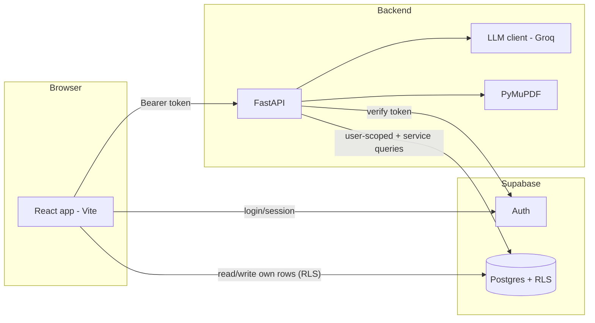

# AI Personal Career Counselor — Project Blueprint

> The single reference for **what** we are building, **why**, and **how**.
> Read this before starting any module. Update it when a decision changes.

- **Owner:** Shalini
- **Last updated:** 2026-09-26
- **Status:** Phase 1 (counselor) mostly built · Phase 2 (coach) not started

---

## Contents

1. [Vision](#1-vision)
2. [The user journey](#2-the-user-journey)
3. [Product principles](#3-product-principles)
4. [Current state](#4-current-state)
5. [Module map & build order](#5-module-map--build-order)
6. [Module specs](#6-module-specs) (M0–M9)
7. [Architecture](#7-architecture)
8. [Data model (Supabase)](#8-data-model-supabase)
9. [Backend API](#9-backend-api)
10. [Frontend structure](#10-frontend-structure)
11. [AI design](#11-ai-design)
12. [Design system — the "nature" theme](#12-design-system--the-nature-theme)
13. [Security & privacy](#13-security--privacy)
14. [Testing & quality](#14-testing--quality)
15. [Deployment](#15-deployment)
16. [Success metrics](#16-success-metrics)
17. [Future ideas (parking lot)](#17-future-ideas-parking-lot)
18. [Decision log](#18-decision-log)
19. [Glossary](#19-glossary)

---

## 1. Vision

**One sentence:** An AI career counselor that first *understands* a student and helps them *choose* the right career, then *coaches* them every day along a game-like roadmap until they are job-ready.

Most career tools do only half the job — either a one-time quiz ("you should be a designer!") or a static roadmap ("learn these 40 things"). Students need both, in that order, and they need a reason to come back tomorrow.

**Two phases, two roles:**

| Phase | Role | Question it answers |
|---|---|---|
| 1. Before a career is chosen | **Counselor** | "Which career actually suits *me*?" |
| 2. After a career is chosen | **Coach** | "Where am I, what do I do today, and am I getting closer?" |

**Target user:** college students (1st year → fresh graduates), mainly in India, unsure of their direction or unsure how to get there.

---

## 2. The user journey

```mermaid
flowchart TD
    A[Landing page] --> B[Sign up / Log in]
    B --> C[Onboarding: education, interests, hours/week, resume]
    C --> D{Knows their goal?}
    D -- "Not sure" --> E[Personality & interest assessment - RIASEC]
    E --> F[AI career matches with reasons]
    F --> G[Explore a career: day-to-day, skills, salary, fit]
    D -- "Yes" --> G
    G --> H[CONFIRM career goal]
    H --> I[Career mode ON: whole site personalises]
    I --> J[Skill gap: what I have vs what I need]
    J --> K[Level map: roadmap as a game world]
    K --> L[Today: tasks + motivation + streak]
    L --> M[Complete tasks -> pass level checkpoint -> unlock next level]
    M --> K
    L --> N[Chat with coach - remembers context]
    N --> L
    K --> O[Job-readiness score rises -> portfolio -> job ready]
```

**The core daily loop (Phase 2):**

> Open app → *"Good morning, future Software Engineer 🌱"* → see today's 2–3 tasks → do them → tick them off → streak grows → level progresses → occasionally pass a checkpoint and unlock the next level → readiness score goes up.

---

## 3. Product principles

1. **Choose first, then plan.** Never show a roadmap before the student has confirmed a goal (or explicitly picked one).
2. **Progress must be earned.** Levels unlock by passing a checkpoint (quiz or project), not by clicking "done". This is what makes the map meaningful.
3. **Always answer "what do I do next?"** Every screen in Phase 2 has one obvious next action.
4. **Specific beats generic.** "You're 2 tasks from finishing *Git basics*" beats a random quote. Quotes are seasoning, not the meal.
5. **AI proposes, structure disposes.** AI output is always validated against a fixed schema and a fixed career list. No free-form AI content goes straight to the user unchecked.
6. **Works without AI.** Every AI feature has a rule-based fallback so the app never breaks when the AI is down or rate-limited.
7. **Changing your mind is allowed.** Switching career goal keeps history and carries over overlapping skills.
8. **Mobile first.** Students will mostly open this on their phone.

---

## 4. Current state

_As of 2026-09-26._

### Tech stack
- **Frontend:** React 19 + Vite + TypeScript + Tailwind v4, react-router, framer-motion, lucide-react, Supabase JS (auth).
- **Backend:** FastAPI (Python 3.12), PyMuPDF (PDF text), Groq (`openai/gpt-oss-120b`, JSON mode).
- **Auth:** Supabase Auth (email/password + Google).
- **Storage today:** Supabase `user_metadata` (onboarding, assessment, targetRole) + browser `localStorage` (roadmap progress). **No database tables yet.**

### Feature status

| Feature | Status | Where |
|---|---|---|
| Landing page | ✅ | `pages/Home.tsx` |
| Auth (email, Google, reset) | ✅ | `context/AuthContext.tsx`, `pages/Login.tsx`, `pages/Signup.tsx` |
| Onboarding (education, interests, hours, resume) | ✅ | `pages/Onboarding.tsx` |
| Resume parsing (AI) | ✅ | `POST /api/upload-resume` |
| RIASEC assessment | ✅ | `pages/Assessment.tsx`, `backend/riasec.py` |
| AI career matching (+ rule fallback) | ✅ | `POST /api/career-match`, `backend/careers.py` |
| Roadmap | 🟡 static list, only 3 careers (software, data, design) + generic | `data/roadmaps.ts`, `pages/Roadmap.tsx` |
| Weekly timetable | 🟡 greedy weekly packing | `lib/planner.ts`, `components/ThisWeekPanel.tsx` |
| Today page | 🟡 basic | `pages/Today.tsx` |
| Career confirmation / career mode | ❌ | — |
| Skill gap | ❌ | — |
| Level map | ❌ | — |
| Checkpoints (quiz / project) | ❌ | — |
| Readiness score | ❌ | — |
| Motivation engine | ❌ | — |
| Chatbot | ❌ | — |
| Database persistence | ❌ | — |

### Known technical debt
- Progress lives in `localStorage` → lost on another device/browser.
- Backend endpoints have **no auth** and CORS is `*` → anyone can burn the Groq quota.
- Two career vocabularies: `backend/careers.py` (source of truth) and `frontend/src/lib/onboarding.ts` `CAREER_MATCHES` (kept in sync manually).
- Resume upload has no size limit.
- No automated tests.
- Frontend bundle is 700 KB (no code splitting).

---

## 5. Module map & build order

### 5a. Finish Phase 1 (the counselor) first — C0–C5

Decided 2026-09-26: complete the counselor role before any Phase 2 work.

| # | Step | Status | What it delivers |
|---|---|---|---|
| **C0** | Save data properly | ✅ built (run `supabase/migrations/0001_phase1_counselor.sql`) | `profiles`, `assessments`, `career_goals` tables with RLS; `ProfileContext` loads profile + latest assessment once; old `user_metadata` data migrates automatically |
| **C1** | "Know me" profile | ✅ built | Discovery now has 5 sections: Interests · Work style · **Values** (top 3) · **Strengths** (strong/enjoyed subjects, known for) · **Your situation** (earning timeline, budget, relocation, family, work setting). All sent to the AI matcher |
| **C2** | Counselor conversation | ⬜ next | After the quiz, the AI asks 3–4 personalised follow-up questions; answers feed the match |
| **C3** | Counselor report | ⬜ | Saved report: "who you are" summary, strengths, top 5 careers with reasons & trade-offs (basic saved results already work) |
| **C4** | Explore & compare careers | ⬜ | `/careers/:slug` detail (day-to-day, salary in India, demand, education path, pros/cons, your fit, similar careers) + compare up to 3 |
| **C5** | Confirm your goal | ⬜ | Deliberate confirm step with "why this career?", writes `career_goals`; "I know my goal" path gets a fit check |

Phase 1 is done when C5 ships; Phase 2 (M1 onward) then starts from a confirmed goal. M0 below shrinks to the parts C0 didn't cover (backend token check, CORS, rate limits, moving roadmap progress off `localStorage`).

### 5b. Phase 2 modules

Build **in this order**. Each module depends on the ones above it.

| # | Module | Phase | Size | Depends on |
|---|---|---|---|---|
| **M0** | Foundation: database, backend auth, move off localStorage | — | M | — |
| **M1** | Career confirmation & career mode (site personalises) | 1→2 | S | M0 |
| **M2** | AI roadmap generator (any career → structured levels) | 2 | L | M1 |
| **M3** | Skill gap analysis + "you are here" | 2 | M | M2 |
| **M4** | Level map UI (nature world, Candy-Crush style) | 2 | L | M2, M3 |
| **M5** | Checkpoints: quizzes & projects to unlock levels | 2 | M | M4 |
| **M6** | Daily planner + smarter Today page | 2 | M | M2 |
| **M7** | Motivation engine & streaks | 2 | S | M6 |
| **M8** | Job-readiness score | 2 | S | M3, M5 |
| **M9** | AI coach chatbot with memory | 2 | L | M1–M8 |

Sizes: **S** ≈ 1–3 days · **M** ≈ 3–6 days · **L** ≈ 1–2 weeks (for one person, part-time adjust accordingly).

**Rule:** finish a module to its *Definition of done* before starting the next. Half-built modules stacked on each other are how projects die.

---

## 6. Module specs

Each module lists: **goal · user stories · what to build · data · API · definition of done**.

---

### M0 — Foundation

**Goal:** a real database and a secure backend, so everything after this is saved per user and synced across devices.

**What to build**
1. Create Supabase tables from [§8](#8-data-model-supabase) with Row Level Security (RLS).
2. Backend verifies the Supabase access token on every `/api/*` call (except `/` and `/api/careers`).
3. Frontend sends `Authorization: Bearer <access_token>` on every backend request (one helper in `lib/api.ts`).
4. Migrate: on first login after this ships, copy `user_metadata.onboarding`, `user_metadata.assessment` and `localStorage` progress into the new tables, then stop writing to them.
5. Lock CORS to the frontend origin(s) via env var `FRONTEND_ORIGINS`.
6. Resume upload: max 5 MB, accept `.pdf` case-insensitively.
7. Rate limit AI endpoints per user (e.g. 30 AI calls/hour) — a simple table or in-memory counter is fine at first.

**Definition of done**
- Log in on two browsers → same progress on both.
- Calling `/api/career-match` without a token → `401`.
- RLS test: user A cannot read user B's rows (try it in the Supabase SQL editor with two test users).

---

### M1 — Career confirmation & career mode

**Goal:** the student explicitly commits to one career. After that, the whole site speaks to "future *X*".

**User stories**
- As a student who took the assessment, I can open a matched career, read about it, and press **"Make this my goal"**.
- As a student who already knows, I can search the career list and pick one.
- After confirming, the header, dashboard and Today page greet me as *"future Software Engineer"*.
- I can change my goal later from Profile (see M1b).

**What to build**
- **Career detail page** `/careers/:slug`: summary, day-to-day, key skills, typical path, fit score & "why it fits you" (from assessment), watch-outs, *"Make this my goal"* button.
- **Confirm dialog:** "Set **Software Engineer** as your goal? Your roadmap and daily plan will be built around it." → confirm.
- **Career mode context** (`context/CareerContext.tsx`): exposes `goal` (title, slug, field, confirmedAt), used everywhere.
- **Personalisation:**
  - Greeting: `Good morning, future {title} 🌱` (time-aware).
  - Accent colour and illustration per **field** (Technology, Data, Design, Business, Healthcare…) — see [§12](#12-design-system--the-nature-theme).
  - Navigation changes: before goal → *Discover, Assessment, Careers*; after goal → *Today, Map, Skills, Coach, Profile*.
- **Routing guard:** Phase 2 pages (`/map`, `/today`, `/skills`, `/coach`) redirect to `/careers` if there is no confirmed goal.

**M1b — Changing goal**
- Profile → "Change my career goal" → pick new career → warning: "Your progress on *Software Engineer* is kept. Skills you already finished will count toward the new goal where they overlap."
- Old goal row gets `status = 'archived'`; new row `status = 'active'`.

**Data:** `career_goals` table.
**API:** `GET /api/careers`, `GET /api/careers/{slug}` (backend, public) · goals are written directly to Supabase from the frontend (RLS).

**Definition of done**
- Confirm a goal → refresh → greeting and nav are personalised.
- Change goal → old progress still visible under "Past goals".

---

### M2 — AI roadmap generator

**Goal:** a high-quality, structured roadmap for **any** career in the taxonomy, not just 3.

**Structure (fixed — this is the contract between AI, database and UI):**

```
Roadmap
└── World (stage)            e.g. "Foundations", "Core skills", "Projects", "Job ready"
    └── Level (skill)        e.g. "Git & GitHub"
        ├── outcomes[]       what you can do after this level
        ├── tasks[]          learn / practice / build items, each with hours + optional URL
        └── checkpoint       quiz topic list OR project brief (see M5)
```

Typical size: **4 worlds × 3–6 levels** = 15–25 levels. Each level 4–15 hours.

**How it works**
1. **Template first.** Hand-curated templates (today's `data/roadmaps.ts`, moved to the backend) exist for the most popular careers. Grow this to ~10 over time. Templates are the gold standard and are used as examples in the AI prompt.
2. **AI fills the rest.** For careers without a template, the backend asks the LLM to produce a roadmap in the exact JSON schema ([§11](#11-ai-design)), validates it with Pydantic, and retries once on failure.
3. **Cache per career.** A generated roadmap is saved in `roadmap_templates` and reused for every student with that career (cheap, consistent, reviewable). Mark `source = 'ai'` vs `'curated'`.
4. **Personalise per student.** The student's own `roadmaps` row is a *copy* of the template adjusted by:
   - education year (condense Foundations for final year / graduates — logic already exists in `lib/onboarding.ts` `educationPace`)
   - skill gap (M3): levels already known are marked `skipped_known`
   - hours per week (drives the planner, M6)
5. **Resources:** prefer free, well-known sources (MDN, freeCodeCamp, official docs, Khan Academy, NPTEL, YouTube channels). AI-suggested URLs must pass a basic check (HTTP 200) before being shown; otherwise show the title without a link.

**Requirements panel** ("what does it take to reach the goal"): for every roadmap also generate
- must-have skills, nice-to-have skills
- typical entry requirements (degree, certifications if any)
- portfolio expectations (e.g. "3 projects, one deployed")
- realistic timeline at the student's hours/week

**Data:** `roadmap_templates`, `roadmaps`.
**API:** `POST /api/roadmap/generate` (idempotent: returns the cached template if it exists).

**Definition of done**
- Every career in `careers.py` produces a valid roadmap (script: loop all 40 careers, validate, report).
- A Nurse gets a nursing roadmap, not the generic one.

---

### M3 — Skill gap analysis

**Goal:** show the student **where they already are** on the map, so it never feels like starting from zero.

**Inputs:** resume skills (parsed), onboarding answers, optional self-rating.

**How it works**
1. **Normalise skills.** Map free-text resume skills to roadmap level ids:
   - first a synonym table (`"JS" → javascript`, `"ReactJS" → react`, `"MS Excel" → excel`)
   - then the LLM for the rest ("Which of these level ids does each skill cover? Return JSON.")
2. **Classify every level:** `have` · `partial` · `missing`.
3. **Confirm with the student:** "Looks like you already know **Python** and **Git**. Skip these levels?" → each can be accepted, or turned into a short **placement quiz** (reuses M5 checkpoints). Never auto-skip silently.
4. **Result screen** `/skills`:
   - ✅ You have (n) · 🟡 Partly (n) · ⬜ To learn (n)
   - Grouped by world, with "Start here →" pointing at the first missing level.

**Data:** `skill_gap` column on `roadmaps` (jsonb) or `level_progress.status = 'skipped_known'`.
**API:** `POST /api/skill-gap` → `{ have: [], partial: [], missing: [], start_level_id }`.

**Definition of done**
- Upload a resume with Python + Git → those levels show as "have" and the map starts further along.

---

### M4 — Level map UI

**Goal:** the roadmap as a **game world** — a winding path through a green, nature-themed landscape, like Candy Crush's level map.

**Look & feel**
- Vertical scroll (mobile-first). Path winds left-right up the screen, bottom = start, top = goal.
- **Each world is a biome** that grows as you progress:
  1. 🌱 *Seed Meadow* — Foundations
  2. 🌳 *Growing Forest* — Core skills
  3. 🏞️ *River Valley* — Projects
  4. ⛰️ *Summit* — Job ready (goal flag at the top with the career name)
- **Level node states:**
  - 🔒 **Locked** — greyed, not clickable (tooltip: "Finish *X* first").
  - 🟢 **Available** — gently pulsing.
  - 📍 **Current** — avatar/marker standing on it ("You are here").
  - ✅ **Completed** — filled, with **1–3 stars** (from checkpoint score).
  - ⏭️ **Known** — completed via skill gap, marked with a small badge.
- Tapping a node opens a **level sheet** (bottom sheet on mobile): outcomes, tasks with checkboxes, hours, checkpoint button.
- Finishing a world plays a short celebration (framer-motion) and reveals the next biome.
- Auto-scroll to the current level on open.

**Implementation notes**
- Render the path as an **SVG** (`<path>` with a smooth curve) with nodes positioned along it; biomes as background layers (SVG/CSS gradients + a few illustrations). Avoid huge images.
- Node positions computed from index (zig-zag) so any number of levels works.
- **Accessible fallback:** a "List view" toggle showing the same data as a plain list (screen readers, low-end phones).
- Keep it light: no game engine, just React + SVG + framer-motion.

**Unlock rule:** level *n+1* unlocks when level *n* is `completed` or `skipped_known`. Worlds unlock in order. (Optional later: allow 2 parallel branches inside a world.)

**Route:** `/map` (replaces `/roadmap` once shipped).

**Definition of done**
- 20+ levels render smoothly on a mid-range phone.
- States update instantly when a task/checkpoint completes.
- Works in light and dark mode; list view works with keyboard only.

---

### M5 — Checkpoints (proof of progress)

**Goal:** a level is completed by *proving* it, which makes the map meaningful. This is the #1 thing that takes the idea from 7.5 → 9.

**Two checkpoint types**
1. **Quiz** (most levels): 5–8 multiple-choice questions generated from the level's outcomes.
   - Pass mark 70 %. Stars: ≥70 % ★, ≥85 % ★★, 100 % ★★★.
   - Unlimited retries, new question set each time (generate a bank of ~20 per level, sample 6).
   - Question banks are generated once per template level and cached (same as roadmaps).
2. **Project** (end of each world): a small brief ("Build a to-do app with React and deploy it").
   - Submit a link (GitHub / deployed URL / Drive) + tick a self-check list.
   - Optional AI review: paste README or code snippet → short feedback. Not a hard gate.

**Rules**
- Tasks inside a level can be ticked freely (that is effort), but the level only turns ✅ after the checkpoint.
- Placement: from the skill-gap screen, a student can take the checkpoint directly to skip a level.

**Data:** `checkpoint_banks`, `checkpoint_attempts`, `projects`.
**API:** `GET /api/checkpoint/{level_id}` (returns questions **without answers**), `POST /api/checkpoint/{level_id}/submit` (grades server-side).

**Definition of done**
- Answers are never sent to the browser before submission.
- Failing shows which outcomes to revisit; passing unlocks the next node with an animation.

---

### M6 — Daily planner + Today page

**Goal:** turn the roadmap into **today's 2–3 tasks**, respecting the student's real schedule.

**Settings (Profile → Study plan):**
- Study days (e.g. Mon–Sat), minutes per day (or per weekday), preferred time (morning/evening).
- Exam mode toggle (lighter plan for N days).

**Algorithm (replaces the weekly greedy packer in `lib/planner.ts`):**
1. Ordered list of remaining tasks from the current level onward (skip completed/known).
2. Split big tasks into sessions of at most the day's budget (a 10 h course → 5 × 2 h sessions).
3. Fill days forward from today using each day's budget.
4. **Missed a day?** Undone tasks roll forward automatically. No red "overdue" wall; show "Plan updated — you're 1 day behind, finish date moved to *Mar 14*".
5. Recompute on: task done, settings change, goal change. Pure function → easy to test.

**Today page (`/today`) — the home screen in career mode:**
1. Greeting + career ("Good evening, future Data Analyst 🌿").
2. **Motivation card** (M7).
3. **Today's tasks** (checkbox, time estimate, link, "why this matters" one-liner).
4. Progress strip: current level, streak 🔥, readiness % (M8).
5. "Coming up this week" (collapsed).
6. **Coach nudge** (M9): "Your coach wants to talk about internships — 2 min."

**Data:** `study_settings`, `task_progress`, `activity_log`.

**Definition of done**
- Change minutes/day → plan and finish date update instantly.
- Skip two days → tasks roll over, nothing is lost.

---

### M7 — Motivation engine & streaks

**Goal:** encouragement that fits the student's **actual situation**, not random quotes.

**Situations (detected by rules, checked in order):**

| Situation | Trigger | Example message |
|---|---|---|
| `first_day` | goal confirmed today | "Day 1 of becoming a Software Engineer. Small steps, every day." |
| `level_just_done` | checkpoint passed in last 24 h | "You finished **Git basics** with ★★★. Next up: **DSA**." |
| `near_milestone` | ≤ 2 tasks left in level/world | "2 tasks to finish the **Foundations** meadow 🌱" |
| `streak` | streak ≥ 3 | "🔥 5-day streak. That's how habits are built." |
| `comeback` | inactive ≥ 3 days, now back | "Welcome back! Your plan has been adjusted — let's restart with one small task." |
| `behind_plan` | finish date slipped ≥ 7 days | "You're a bit behind — want to reduce daily load or extend the date?" (with buttons) |
| `exam_mode` | exam mode on | "Exams first. Just 15 minutes today keeps the streak alive." |
| `default` | none of the above | A quote from the library tagged to the career field or to growth/persistence. |

**How messages are made**
- Rules pick the situation; **templates** fill in the numbers (fast, free, reliable).
- Optional: LLM rewrites the template in a warmer tone once per day (cached in `daily_messages`). Fallback = template.
- **Quote library:** ~100 short quotes tagged by situation and field, stored in the backend. Always attribute the author; avoid made-up attributions.

**Streaks**
- A day counts if the student completes ≥ 1 task or ≥ 15 minutes.
- **1 free "streak freeze"** per week (auto-used) so one bad day doesn't kill motivation.
- Longest streak shown in Profile.

**Definition of done**
- Each situation can be triggered in a test with fake data and shows the right message.

---

### M8 — Job-readiness score

**Goal:** one honest number: *"You're 42 % ready for a junior Data Analyst role."*

**Formula (v1 — tune later):**

```
readiness = 0.60 × weighted_levels_done
          + 0.25 × average_checkpoint_score (passed levels only)
          + 0.15 × projects_score

weighted_levels_done = Σ(weight of completed/known levels) / Σ(all level weights)
    level weight: Foundations 1, Core 2, Projects 2, Job ready 1.5
projects_score = min(1, submitted_world_projects / required_projects)
```

- Show on Today and Profile with a breakdown ("Skills 55 % · Quiz mastery 80 % · Portfolio 1/3").
- Milestones at 25 / 50 / 75 / 100 % trigger a celebration and a motivation message.
- At 75 %+: unlock a **"Job ready" checklist** — resume review (reuse resume parser), LinkedIn tips, mock interview questions from the coach.

**Definition of done**
- Score is a pure function with unit tests; changes immediately when a level completes.

---

### M9 — AI coach chatbot with memory

**Goal:** a coach that **knows** the student and **remembers** past conversations — and plans what to discuss next.

**What the coach knows (context sent with every message):**
- Profile: name, education year, interests, RIASEC code
- Goal: career, confirmed date
- Progress: current world/level, readiness %, streak, recent completions, anything behind plan
- **Memory:** a running summary of past conversations + open follow-ups

**Memory design**
1. After each conversation (or every ~10 messages), the backend asks the LLM to update a **summary** (≤ 200 words) and a list of **follow-ups**:
   ```json
   { "summary": "...", "follow_ups": [
       { "topic": "Internship applications", "when": "2026-10-03", "why": "Student asked how to find internships after finishing Projects world" } ] }
   ```
2. Follow-ups whose date arrives appear on the **Today page** as a coach nudge — this is the *"what we'll discuss in upcoming days"* feature.
3. Student can view and clear memory in Profile (privacy).

**Guardrails**
- Stays on career/learning topics; politely redirects off-topic requests.
- Never gives medical, legal or financial advice beyond general career information.
- If a student expresses distress, respond with empathy and point to real help (e.g. college counselor, a helpline) — no diagnosis.
- Rate limit per user; show a friendly message when exceeded.
- The coach **can suggest actions** as buttons ("Reduce my daily load", "Take the Git quiz") that call existing app features — it never changes data by itself without a tap.

**UI:** `/coach` full page + a floating button on Phase 2 pages. Streamed responses. Suggested starter questions based on situation.

**Data:** `chat_threads`, `chat_messages`, `coach_memory`.
**API:** `POST /api/coach/message` (streaming), `POST /api/coach/summarise`.

**Definition of done**
- Ask about internships on Monday → on the follow-up date the Today page shows the nudge and the coach opens with that topic.

---

## 7. Architecture



**Who does what**
- **Frontend → Supabase directly** for simple CRUD on the user's own rows (goals, task ticks, settings). RLS guarantees isolation. Fast and simple.
- **Frontend → FastAPI** for anything that needs **AI, secrets, grading or shared data**: resume parsing, career matching, roadmap generation, skill gap, checkpoints (answers are secret), coach chat.
- **FastAPI → Supabase** with the **service role key** only for shared tables (`roadmap_templates`, `checkpoint_banks`) and for writing grading results. Never expose the service key to the browser.

**LLM provider abstraction:** all AI calls go through one module (`backend/ai.py`) with `generate_json(prompt, schema)` and `chat_stream(messages)`. Switching providers (Groq → other) = change one file + env vars.

---

## 8. Data model (Supabase)

All user tables have `user_id uuid references auth.users` and RLS: `using (auth.uid() = user_id)`.

```sql
-- ---------- Profile & phase 1 ----------
create table profiles (
  user_id        uuid primary key references auth.users on delete cascade,
  full_name      text,
  college        text,
  course         text,
  year           text,              -- '1st year' | ... | 'Graduate'
  interests      text[] default '{}',
  hours_per_week int,
  resume         jsonb,             -- {name, education[], skills[], experience[]}
  created_at     timestamptz default now(),
  updated_at     timestamptz default now()
);

create table assessments (
  id          uuid primary key default gen_random_uuid(),
  user_id     uuid not null references auth.users on delete cascade,
  answers     jsonb not null,       -- {item_id: 0|1|2}
  scores      jsonb not null,       -- {R: 0-100, ...}
  code        text not null,        -- e.g. 'ICR'
  matches     jsonb,                -- AI/rule matches shown
  source      text check (source in ('ai','rule')),
  created_at  timestamptz default now()
);

create table career_goals (
  id            uuid primary key default gen_random_uuid(),
  user_id       uuid not null references auth.users on delete cascade,
  career_slug   text not null,      -- from backend taxonomy
  career_title  text not null,
  field         text not null,
  status        text not null default 'active' check (status in ('active','archived')),
  confirmed_at  timestamptz default now()
);
create unique index one_active_goal on career_goals(user_id) where status = 'active';

-- ---------- Roadmaps ----------
create table roadmap_templates (         -- shared, written by backend only
  career_slug  text primary key,
  version      int not null default 1,
  source       text check (source in ('curated','ai')),
  content      jsonb not null,           -- worlds -> levels -> tasks/checkpoint (see §11 schema)
  requirements jsonb,                    -- must/nice skills, entry reqs, portfolio, timeline
  created_at   timestamptz default now()
);

create table roadmaps (                   -- the student's personalised copy
  id              uuid primary key default gen_random_uuid(),
  user_id         uuid not null references auth.users on delete cascade,
  goal_id         uuid not null references career_goals on delete cascade,
  template_slug   text not null references roadmap_templates,
  template_version int not null,
  content         jsonb not null,
  skill_gap       jsonb,                  -- {have[], partial[], missing[]}
  created_at      timestamptz default now()
);

create table level_progress (
  user_id     uuid not null references auth.users on delete cascade,
  roadmap_id  uuid not null references roadmaps on delete cascade,
  level_id    text not null,
  status      text not null check (status in ('locked','available','in_progress','completed','skipped_known')),
  stars       int check (stars between 0 and 3),
  completed_at timestamptz,
  primary key (roadmap_id, level_id)
);

create table task_progress (
  user_id     uuid not null references auth.users on delete cascade,
  roadmap_id  uuid not null references roadmaps on delete cascade,
  task_id     text not null,              -- '{level_id}::{index}'
  done_at     timestamptz default now(),
  minutes     int,
  primary key (roadmap_id, task_id)
);

-- ---------- Checkpoints ----------
create table checkpoint_banks (           -- shared, backend only; contains answers
  level_key   text primary key,           -- '{career_slug}:{level_id}:v{version}'
  questions   jsonb not null
);

create table checkpoint_attempts (
  id          uuid primary key default gen_random_uuid(),
  user_id     uuid not null references auth.users on delete cascade,
  roadmap_id  uuid not null references roadmaps on delete cascade,
  level_id    text not null,
  score       numeric not null,           -- 0..1
  passed      boolean not null,
  created_at  timestamptz default now()
);

create table projects (
  id          uuid primary key default gen_random_uuid(),
  user_id     uuid not null references auth.users on delete cascade,
  roadmap_id  uuid not null references roadmaps on delete cascade,
  world_id    text not null,
  url         text not null,
  checklist   jsonb,
  ai_feedback text,
  created_at  timestamptz default now()
);

-- ---------- Planner, streaks, motivation ----------
create table study_settings (
  user_id        uuid primary key references auth.users on delete cascade,
  minutes_by_day jsonb not null default '{"mon":60,"tue":60,"wed":60,"thu":60,"fri":60,"sat":90,"sun":0}',
  preferred_time text default 'evening',
  exam_mode_until date,
  timezone       text default 'Asia/Kolkata'
);

create table activity_log (               -- one row per active day -> streaks
  user_id   uuid not null references auth.users on delete cascade,
  day       date not null,
  minutes   int default 0,
  tasks_done int default 0,
  freeze_used boolean default false,
  primary key (user_id, day)
);

create table daily_messages (
  user_id   uuid not null references auth.users on delete cascade,
  day       date not null,
  situation text not null,
  message   text not null,
  primary key (user_id, day)
);

-- ---------- Coach ----------
create table chat_threads (
  id         uuid primary key default gen_random_uuid(),
  user_id    uuid not null references auth.users on delete cascade,
  title      text,
  created_at timestamptz default now()
);

create table chat_messages (
  id         bigserial primary key,
  thread_id  uuid not null references chat_threads on delete cascade,
  user_id    uuid not null references auth.users on delete cascade,
  role       text not null check (role in ('user','assistant')),
  content    text not null,
  created_at timestamptz default now()
);

create table coach_memory (
  user_id    uuid primary key references auth.users on delete cascade,
  summary    text,
  follow_ups jsonb default '[]',          -- [{topic, when, why, done}]
  updated_at timestamptz default now()
);
```

**RLS template** (repeat for every user table):

```sql
alter table profiles enable row level security;
create policy "own rows" on profiles
  for all using (auth.uid() = user_id) with check (auth.uid() = user_id);
```

`roadmap_templates`: RLS on, `select` allowed for authenticated users, no insert/update policy (backend uses service key).
`checkpoint_banks`: RLS on, **no policies at all** (only the backend can read it — answers stay secret).

Keep SQL in `supabase/migrations/NNNN_description.sql` so the schema is versioned in git.

---

## 9. Backend API

All `/api/*` routes require `Authorization: Bearer <supabase access token>` unless marked **public**.

| Method | Path | Module | Purpose |
|---|---|---|---|
| GET | `/` | — | Health + `ai_enabled` (**public**) |
| GET | `/api/careers` | M1 | Career taxonomy (**public**) |
| GET | `/api/careers/{slug}` | M1 | One career's detail |
| POST | `/api/upload-resume` | ✅ | PDF → structured resume |
| GET | `/api/assessment/questions` | ✅ | RIASEC items |
| POST | `/api/assessment/score` | ✅ | Deterministic scoring |
| POST | `/api/career-match` | ✅ | AI-ranked careers (rule fallback) |
| POST | `/api/roadmap/generate` | M2 | Get/generate template for a career |
| POST | `/api/roadmap/personalise` | M2/M3 | Create the student's roadmap copy |
| POST | `/api/skill-gap` | M3 | Resume skills → have/partial/missing |
| GET | `/api/checkpoint/{level_id}` | M5 | Questions without answers |
| POST | `/api/checkpoint/{level_id}/submit` | M5 | Grade, store attempt, unlock next |
| POST | `/api/project/review` | M5 | Optional AI feedback |
| GET | `/api/today` | M6/M7 | Today's tasks + motivation + nudges |
| POST | `/api/coach/message` | M9 | Streamed coach reply |
| POST | `/api/coach/summarise` | M9 | Update memory & follow-ups |

**Backend folder layout (target):**

```
backend/
├── main.py              # app, CORS, router includes
├── auth.py              # verify Supabase JWT -> current_user dependency
├── ai.py                # LLM provider wrapper: generate_json, chat_stream
├── db.py                # Supabase client (service role)
├── data/
│   ├── careers.py       # taxonomy (source of truth)
│   ├── riasec.py
│   ├── quotes.py
│   └── templates/       # curated roadmap JSON files
├── routers/
│   ├── resume.py  assessment.py  careers.py  roadmap.py
│   ├── skillgap.py  checkpoint.py  today.py  coach.py
├── services/
│   ├── planner.py       # pure scheduling logic
│   ├── motivation.py    # situation rules + templates
│   ├── readiness.py     # score formula
│   └── skills.py        # synonym normalisation
├── schemas.py           # Pydantic models incl. Roadmap schema
└── tests/
```

---

## 10. Frontend structure

**Routes**

| Route | Phase | Page |
|---|---|---|
| `/` | public | Landing |
| `/login`, `/signup` | public | Auth |
| `/onboarding` | 1 | About you + resume |
| `/assessment` | 1 | RIASEC quiz + matches |
| `/careers` | 1 | Browse / search careers |
| `/careers/:slug` | 1 | Career detail + "Make this my goal" |
| `/today` | 2 | **Home in career mode** |
| `/map` | 2 | Level map |
| `/map/level/:id` | 2 | Level sheet (tasks + checkpoint) |
| `/skills` | 2 | Skill gap |
| `/coach` | 2 | Chatbot |
| `/profile` | both | Profile, study settings, change goal, memory, data export/delete |

`/dashboard` becomes a smart redirect: no goal → `/careers` (or `/assessment`), goal → `/today`.

**Target folder layout**

```
frontend/src/
├── app/            App.tsx, routes, providers
├── context/        AuthContext, CareerContext
├── lib/            api.ts (fetch + token), supabase.ts, planner.ts, readiness.ts
├── features/
│   ├── onboarding/  assessment/  careers/
│   ├── map/         (LevelMap.tsx, LevelNode.tsx, Biome.tsx, LevelSheet.tsx)
│   ├── skills/      checkpoint/  today/  motivation/  coach/  profile/
├── components/     shared UI (Button, Card, Sheet, ProgressRing, …)
└── styles/         theme tokens
```

**State:** React context for auth + career goal; data fetching with a small cache (TanStack Query recommended once M0 lands).

---

## 11. AI design

**Provider:** Groq, model `openai/gpt-oss-120b` (env `GROQ_MODEL`), JSON mode. All calls via `backend/ai.py`.

**Rules for every AI feature**
1. Output must be **JSON matching a Pydantic schema**. Invalid → retry once with the validation error → else fallback.
2. Choices are constrained to known ids (career titles, level ids) — anything unknown is dropped.
3. Temperature: 0 for extraction/grading, 0.3 for ranking/generation, 0.7 for chat.
4. Cache anything shared (roadmap templates, question banks).
5. Log prompt name, latency, token counts, success/fallback — never log resume text or chat content in production logs.

**Roadmap JSON schema (the contract)**

```json
{
  "career": "Data Analyst",
  "worlds": [
    {
      "id": "foundations",
      "title": "Foundations",
      "biome": "meadow",
      "goal": "Comfortable with spreadsheets, basic stats and SQL basics",
      "levels": [
        {
          "id": "excel-basics",
          "title": "Spreadsheets & Excel",
          "outcomes": ["Clean a messy dataset", "Build a pivot table"],
          "tasks": [
            { "title": "Excel crash course", "type": "course", "hours": 4, "url": "https://..." },
            { "title": "Clean the sample sales sheet", "type": "practice", "hours": 2 }
          ],
          "checkpoint": { "type": "quiz", "topics": ["formulas", "pivot tables", "data cleaning"] }
        }
      ],
      "world_project": { "title": "Sales dashboard", "brief": "...", "checklist": ["..."] }
    }
  ],
  "requirements": {
    "must_have": ["SQL", "Excel", "Statistics"],
    "nice_to_have": ["Python", "Tableau"],
    "entry": "Any degree; quantitative background helps",
    "portfolio": "2-3 analysis projects with write-ups",
    "typical_months_at_8h_week": 8
  }
}
```

**Prompts to write (store in `backend/prompts/` as text files, versioned):**
`resume_extract`, `career_match`, `roadmap_generate`, `skill_map`, `quiz_generate`, `project_review`, `coach_system`, `coach_summarise`, `motivation_rewrite`.

**Free-tier limits:** Groq free tier has per-minute token and request limits. Mitigate with caching, truncating resume text (already 12 000 chars), per-user rate limits and the rule-based fallbacks.

---

## 12. Design system — the "nature" theme

**Mood:** calm, growing, hopeful. Progress = things growing.

**Palette (tokens, define in CSS variables with dark-mode versions):**

| Token | Light | Use |
|---|---|---|
| `--leaf` | `#2E9E5B` | primary actions, completed levels |
| `--sprout` | `#8BD17C` | available levels, highlights |
| `--meadow` | `#EAF7E4` | page background (Phase 2) |
| `--bark` | `#6B4F3A` | path, secondary text accents |
| `--sky` | `#CFEFFF` | top of map / summit |
| `--sun` | `#F6C445` | stars, streak flame, celebrations |
| `--stone` | `#9AA5A0` | locked levels |

Phase 1 (discovery) keeps the current purple brand; **Phase 2 switches to the nature palette** — a visible "you've started your journey" moment.

**Per-field accent** (small touches — icon, badge, illustration): Technology 💻 teal · Data 📊 blue · Design 🎨 pink · Business 💼 amber · Healthcare 🩺 red · Education 📚 orange · Engineering ⚙️ slate · Media 🎬 purple · Sports 🏅 green.

**Motion:** gentle only — pulse on available node, grow/bloom on completion, confetti-leaves on world completion. Respect `prefers-reduced-motion`.

**Voice:** friendly, short, specific, never guilt-tripping. "Let's pick up where you left off" not "You missed 3 days".

---

## 13. Security & privacy

- **Secrets:** `.env` files are git-ignored. Service role key only on the backend. Frontend only gets the publishable/anon key.
- **Auth:** backend verifies Supabase JWT on every private route. CORS limited to known origins.
- **RLS** on every table; `checkpoint_banks` has no client access.
- **Resumes** contain personal data: process in memory, store only the extracted fields, never the PDF. Don't log contents.
- **Chat** content is private; user can view/delete coach memory and chat history.
- **Account deletion** (Profile) deletes all rows via `on delete cascade`.
- **AI safety:** see M9 guardrails. Prompt-injection from resumes: treat resume text as data, never as instructions (say so in the prompt), and validate output.
- **Limits:** 5 MB upload, per-user AI rate limit, request timeouts.

---

## 14. Testing & quality

| Layer | Tool | What to test |
|---|---|---|
| Backend unit | `pytest` | RIASEC scoring, fallback matcher, planner, motivation rules, readiness formula, schema validation |
| Backend API | `pytest` + `TestClient` | auth required, 401s, happy paths with the AI mocked |
| AI quality | script | generate roadmaps for all careers, validate schema, spot-check 5 by hand each release |
| Frontend unit | Vitest | `planner.ts`, `readiness.ts`, map node positioning |
| E2E | Playwright | sign up → onboarding → assessment → confirm goal → map → pass a checkpoint |
| Lint/types | `tsc -b`, `oxlint` | run before every commit |

**Rule:** every pure logic function (planner, readiness, motivation, scoring) ships with tests — they're the easiest to break silently.

---

## 15. Deployment

| Part | Suggested host (free tiers) |
|---|---|
| Frontend | Vercel or Netlify (`npm run build` → `dist/`) |
| Backend | Render or Railway (`uvicorn main:app --host 0.0.0.0 --port $PORT`) |
| Database + Auth | Supabase |

**Env vars**

| Where | Name | Notes |
|---|---|---|
| backend | `GROQ_API_KEY` | required for AI |
| backend | `GROQ_MODEL` | optional, default `openai/gpt-oss-120b` |
| backend | `SUPABASE_URL` | M0 |
| backend | `SUPABASE_SERVICE_ROLE_KEY` | M0, **secret** |
| backend | `SUPABASE_JWT_SECRET` or JWKS URL | M0, token verification |
| backend | `FRONTEND_ORIGINS` | M0, comma-separated CORS list |
| frontend | `VITE_SUPABASE_URL` | |
| frontend | `VITE_SUPABASE_ANON_KEY` | publishable key |
| frontend | `VITE_API_BASE` | backend URL in production |

Also: add the production URL to Supabase **Auth → URL configuration** (redirects for email confirm and Google login).

---

## 16. Success metrics

| Metric | Why | Target (early) |
|---|---|---|
| Onboarding → goal confirmed | Phase 1 works | ≥ 50 % |
| Day-7 retention | the daily loop works | ≥ 25 % |
| Median streak | habit formation | ≥ 4 days |
| Levels completed / active user / week | real progress | ≥ 1 |
| Checkpoint pass rate (first try) | difficulty is right | 50–75 % |
| Coach messages / active user / week | coach is useful | ≥ 3 |

Track with a simple `events` table or a privacy-friendly analytics tool once there are real users.

---

## 17. Future ideas (parking lot)

Not in scope until M0–M9 are done:

- Email / push reminders at the preferred study time
- Peer groups / study buddies on the same career
- Mentor marketplace (real humans)
- Internship & job listings matched to readiness
- Mock interviews (voice) with the coach
- Resume builder that updates as levels complete
- College/placement-cell dashboard (B2B)
- Multiple languages (Hindi, Kannada, Tamil, …)
- Offline-friendly PWA

---

## 18. Decision log

| Date | Decision | Why |
|---|---|---|
| 2026-09-25 | Backend career list (`careers.py`) is the single source of truth | Avoid drift between frontend and backend titles |
| 2026-09-26 | LLM provider = Groq (free tier), model `openai/gpt-oss-120b` | Gemini not available to the owner; Llama 3.3 retired on Groq |
| 2026-09-26 | Levels unlock via checkpoints, not "mark done" | Makes the map meaningful; key to moving from 7.5 → 9 |
| 2026-09-26 | Roadmaps: curated templates + AI-generated & cached per career | Quality where it matters, coverage for everything else, low cost |
| 2026-09-26 | Motivation = rules + templates first, AI tone optional | Specific, reliable, free; quotes only as fallback |
| 2026-09-26 | Frontend writes simple rows via Supabase RLS; AI/secret/grading via FastAPI | Simplest secure split |
| 2026-09-26 | Finish Phase 1 (C0–C5) before any Phase 2 module | A roadmap is only as good as the career choice behind it |
| 2026-09-26 | "Know me" = values, strengths, real-life constraints; constraints can lower but not hide a strong match (shown in watch-outs) | Mirrors how a human counselor weighs trade-offs honestly |

_Add a row whenever a significant decision is made or reversed._

---

## 19. Glossary

- **RIASEC / Holland code** — six interest types (Realistic, Investigative, Artistic, Social, Enterprising, Conventional); a person's top three form their code, e.g. `ICR`.
- **Career mode** — the state after a student confirms a goal; Phase 2 UI is active.
- **World** — a stage of the roadmap, shown as a biome on the map.
- **Level** — one skill inside a world; a node on the map.
- **Task** — one learning/practice/build item inside a level.
- **Checkpoint** — quiz or project that completes a level/world.
- **Skill gap** — the difference between what the student has and what the roadmap requires.
- **Readiness** — 0–100 % score of how job-ready the student is for their goal.
- **Follow-up** — a topic the coach plans to raise on a future date.
- **RLS** — Supabase Row Level Security; each user can only access their own rows.
